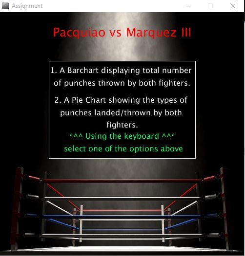
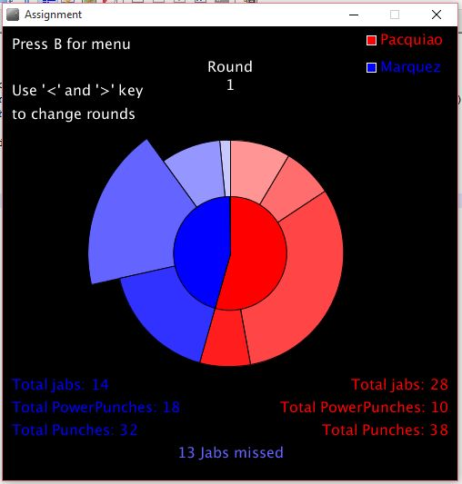
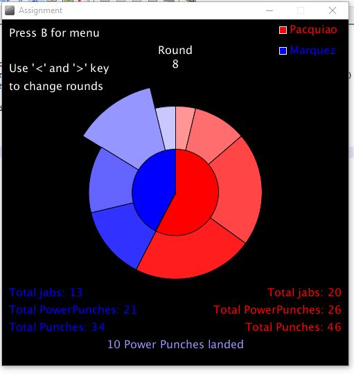
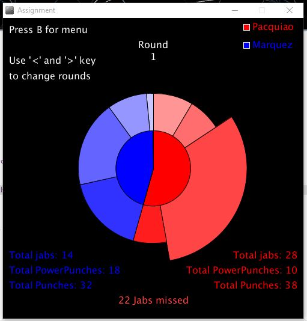

# Kai-Assignment
My assignment for programming.

I plan to use the dataset gathered from a boxing match between Manny Pacquiao and Juan Manuel Márquez.
I will present the dataset by using pie charts(Percentage of punches laned) and bar charts(Punches thrown per round),
the program should allow users to view and compare the data of both fighters. 

I plan to look into animation and possibly 3d visualisation for the advanced features.

2nd and Final Deliverable

For the core features I was successful in impletementing a barchart and a Donut/Pie chart(idea from League of Legends). 
The user can interacts with the program by pressing keys to choose what visualisation to display. The user 
can also interact with the barchart and piechart by using the mouse and hovering over certain elements for extra information. 

For the advance features I tried adding classes in my program, at the time I wasn't too familiar with classes and 
I feel that classes wasn't really suited with the way I was working with my data and that my data was too small, I realised
after I added the classes that I didn't really need them since I had only two fighters to compare. It probably would have made more 
sense to create a class called "Fighter" and make 2 instances of "Fighter" with different data, but if i did it that way I wouldn't
know how to display both data in a way that allows the user to look and compare both data sets at the same time (like the piechart).

The second advance feature is the mouse hovering over elements to get more details. I also added sound for the keypress.

Here are some Snapshots

Menu for my program

Bar chart

Different rounds for Donut/pie chart

